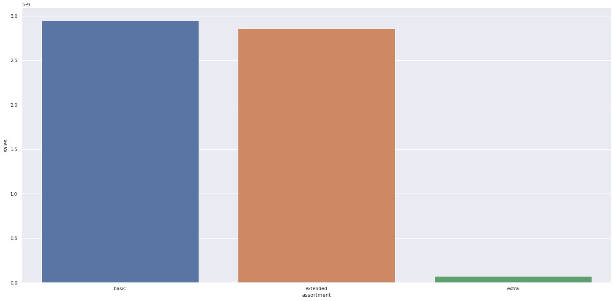
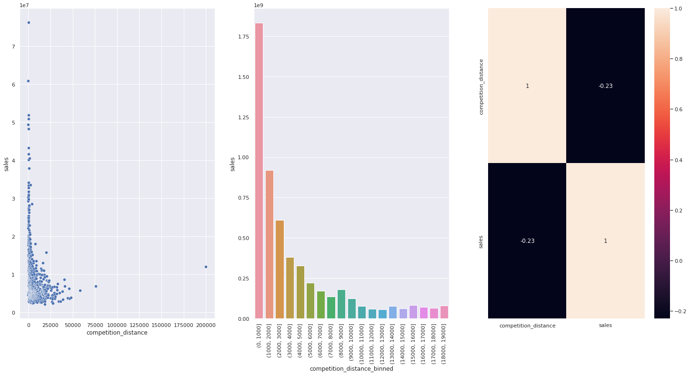
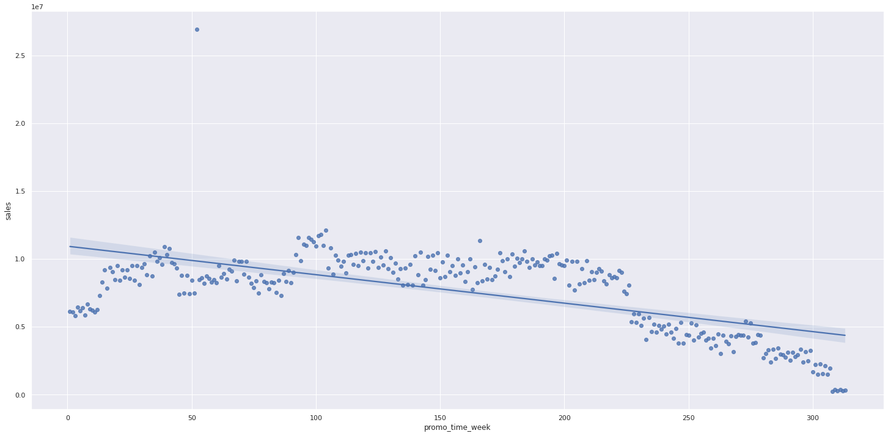
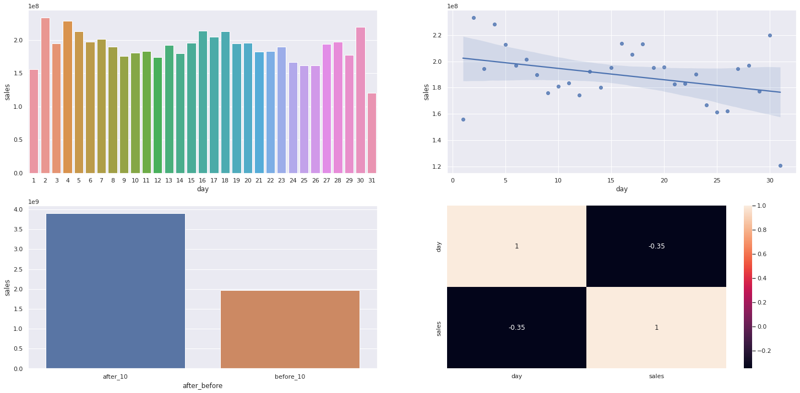
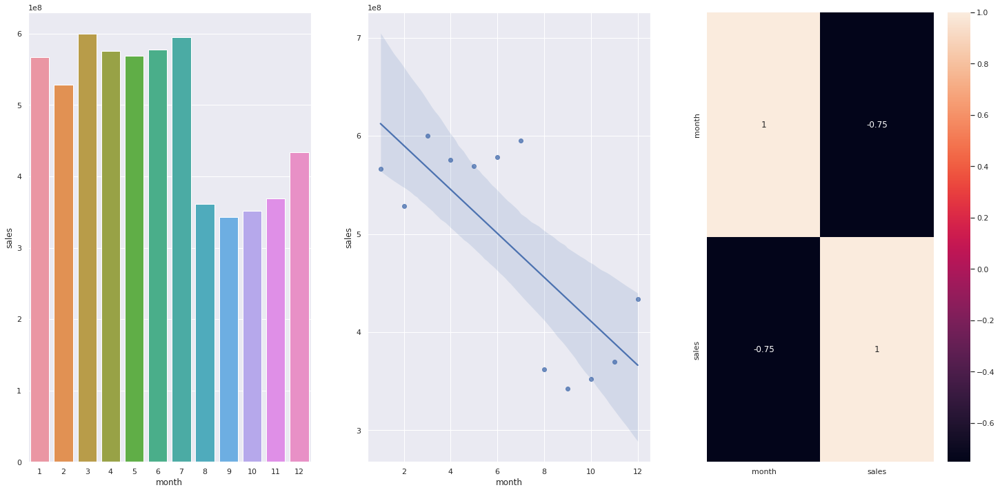
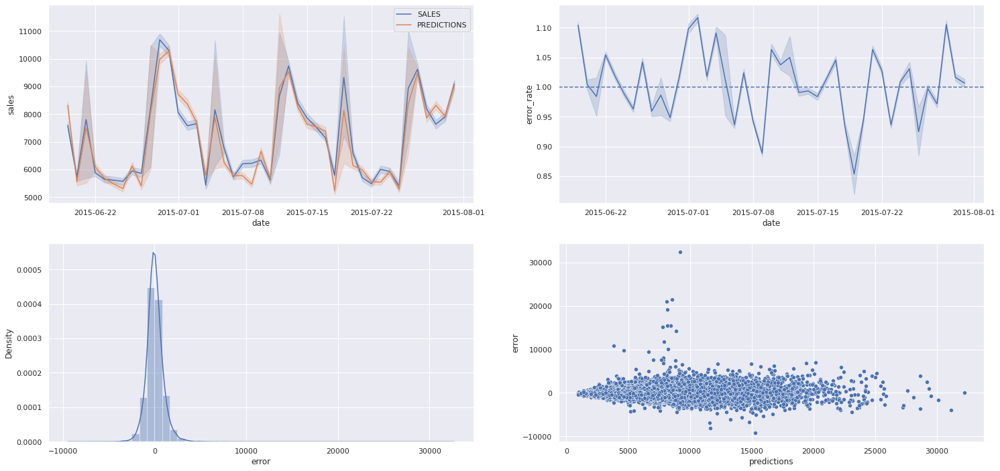

<h1 align="center">
  
</h1>

## 1.0. Introdução ao problema de negócio

A Rossmann é uma rede de drogarias com mais de 3.000 lojas ativas em 7 países europeus. O CFO da empresa planeja fazer uma reforma em cada loja, e em reunião com todos os gerentes indivíduais solicitou uma previsão diaria das próximas 6 semanas de vendas de cada loja, pois com base nessas informações seria definido o total destinado a cada uma.

Como Cientistas de Dados da Rossmann, fomos acionados para trabalhar em uma solução.

### 1.1. Questões do negócio

- Fazer uma predição das vendas diarias de cada loja pelas próximas 6 semanas

## 2.0. Premissas do negócio

- A coluna "Costumers" foi dropada pois é uma informação que não podemos ter no momento em que estivermos fazendo o treinamento do nosso modelo, já que não sabemos quantos clientes teremos nas nossas lojas ao longo das próximas 6 semanas

- Os valores vazios da coluna "competition_distance" foram substituídos por 3 vezes o valor maximo do competidor mais distante. Estamos assumindo que se não temos essa informação, não temos competidores mais próximos e então estamos extrapolando no valor dos dados faltantes.

## 3.0. Planejamento da Solução

### 3.1. Entrega Final

- A entrega será de um Bot no Telegram, que opere 24/7 e seja capaz de devolver a soma total da predição das próximas 6 semanas de vendas da loja requisitada

### 3.2. Ferramentas

- Python 3.8.15
- Jupyter Notebook
- Matplotlib and Seaborn
- Scikit Learn
- XGBoost
- Boruta 
- Random Search
- Git and Github
- Render
- Telegram Bot

### 3.3. Processo até a solução

Iremos utilizar o método CRISP-DS ao longo do projeto, seguindo todas as suas etapas e visando uma primeira entrega mais
rápida porem mantendo uma boa qualidade, posteriormente poderemos voltar para o inicio do ciclo novamente afim de implementar novas tecnicas e melhorias no 
projeto caso o resultado final ainda não esteja satisfatório.

- **Business Understand:** Entender mais sobre a motivação do CFO por trás da solicitação da predição de vendas.

- **Data Description:** Entender o quão desafiador é o problema que temos em mãos, conseguiremos responder se temos recursos para trabalhar, quais sãos os tipos de variaveis que temos e a porcentagem de cada uma, a quantidade de dados faltantes e a estatistica descritiva dos dados.

- **Feature Engineering:** Derivação de novas features através das originais, que irão nos ajudar na melhoria do modelo de ML, alem de ser parte importante para a validação das hipoteses levantadas e insights para o negócio.

- **EDA:** Entendimento de como as variáveis impactam no fenomeno de vendas, e qual a força desse impacto. Aqui ganhamos experiência do negócio, validaremos as hipoteses levantadas anteriormente e com isso iremos conseguir ter a percebepção de quais variáveis são importantes para descrever nosso fenomeno.

- **Data Preparation:** Parte onde os dados são preparados para que possam ser recebidos pelo modelo de ML, dados categóricos e numéricos recebem diferentes tratamentos para que posssam ficar em uma escala numérica.

- **Feature Selection:** Selecionando as melhores features para o modelo, utilizando o Boruta.  

- **Machine Learning Modeling:** Treinamento dos principais algoritmos de regressão e validação usando o cross-validation time series. 

- **Hyperparameter Fine Tunning:** Utilizado a tecnica de Random Search para escolher os melhores parametros para performance do algoritmo escolhido.

- **Avaliação do modelo:** Utilizado as metricas de MAE, MAPE e RMSE para checar a performance do algoritmo.

- **Resultados financeiros:** Tradução do resultado do modelo para um resultado financeiro, tornando fácil o entendimento dos resultados.

-  **Deploy para produção:** Criação de um Bot do Telegram que seja capaz de me dar o resultado da predição a partir do numero da loja escolhida. 

## 4.0. Os 5 principais insights do negócio

- ### **H1:** Lojas com sortimentos menores vendem mais 
<h1 align="center"></h1>

- ### **H2:** Lojas com competidores próximos vendem mais
<h1 align="center"></h1>

- ### **H3:** Lojas com promoções muito longas tem queda nas vendas ao longo do tempo
<h1 align="center"></h1>

- ### **H4:** As lojas vendem mais depois do dia 10 de cada mês
<h1 align="center"></h1>

- ### **H5:** As lojas vendem mais no primeiro semestre do ano
<h1 align="center"></h1>

## 5.0. Modelo de Machine Learning

Com nossos dados já tratados e prontos para serem utilizados, escolhemos cinco algoritmos de Regressão
nesse primeiro ciclo do CRISP, onde iremos fazer o treinamento de cada um e o modelo que melhor performar será
escolhido para ter seus parametros tunados na etapa seguinte.

- Average Model (Baseline model)
- Linear Regression
- Linear Regression Regularized Model
- Random Forest Regressor
- XGBoost Regressor

### 5.1. Resultado singular

| MODEL NAME              | MAE         | MAPE     | RMSE        |
|-------------------------|-------------|----------|-------------|
| Random Forest Regressor | 679.100778  | 0.099894 | 1010.139337 |
| XGBoost Regressor       | 867.333164  | 0.126841 | 1270.995299 |
| Average Model           | 1354.800353 | 0.206400 | 1835.135542 |
| Linear Regression       | 1867.089774 | 0.292694 | 2671.049215 |
| Lasso                   | 1891.704881 | 0.289106 | 2744.451740 |

### 5.2. Performance Real - Cross Validation Time Series

| MODEL NAME              | MAE               | MAPE          | RMSE               |
|-------------------------|-------------------|---------------|--------------------|
| Random Forest Regressor | 829.42 +/- 105.66 | 0.12 +/- 0.02 | 1263.03 +/- 191.46 |
| XGBoost Regressor       | 1080.33 +/- 77.22 | 0.15 +/- 0.01 | 1577.18 +/- 117.34 |
| Linear Regression       | 1992.27 +/- 41.68 | 0.29 +/- 0.01 | 2846.37 +/- 87.77  |
| Lasso                   | 2035.84 +/- 54.02 | 0.29 +/- 0.0  | 2964.68 +/- 89.66  |

### 5.3. Seleção do modelo

O modelo selecionado foi o XGBoost, apesar de estar atrás do Random Forest em questão de performance, esse
modelo possui outras caracteristicas a qual o fez ser o escolhido, os principais pontos são:

- O treinamento do XGBoost é mais rápido
- Mais leve em comparação ao Random Forest (Infraestrutura)
- A diferença de performance não foi grande, então podemos abrir mão dessa pequena diferença

### 5.4. Resultado após ajuste nos hyperparametros do modelo

Aplicado o metodo de **Random Search** para encontrar os melhores hyperparametros para serem usados no treinamento
do XGBoost, o resultado foi o seguinte:

| MODEL NAME        | MAE               | MAPE          | RMSE               |
|-------------------|-------------------|---------------|--------------------|
| XGBoost Regressor | 666.86415 | 0.098439	 | 957.139598 |

<h1 align="center"></h1>

## 6.0. Bussiness Results

A partir do resultado das predições do modelo, conseguimos montar uma tabela onde é possível ver os resultados
financeiros para o negócio. Nessa tabela, podemos enxergar qual foi a predição das vendas do modelo para determinada
loja e também quais são o pior e o melhor cenário dentro das previsões feitas.

| LOJAS	 | PREDIÇÕES      | PIOR CENARIO  | MELHOR CENARIO  | MAE       | MAPE   |
|--------|----------------|---------------|-----------------|-----------|--------|
| 1      | 164276.046875  | 163961.277575 | 164590.816175   |314.769300 |0.072475|
| 2      | 177526.093750  | 177181.052160 | 177871.135340   |345.041590 |0.071908|
| 3      | 261450.015625  | 260877.777766 | 262022.253484   |572.237859 |0.081624|
| ...    | ...            | ...           | ...             |...        |...     |
| 1111   | 178148.796875  | 177538.571725 | 178759.022025   |610.225150 |0.131337|
| 1112   | 344778.156250  | 343658.650483 | 345897.662017   |1119.505767|0.132453|
| 1113   | 241641.015625  | 241126.693214 | 242155.338036   |514.322411 |0.079661|

De acordo com o resultado do modelo, a soma total de vendas de todas as farmácias ao longo de 6 semanas é:

| CENARIO         | VALORES          |
|-----------------|------------------|
| predições       | R$287,963,072.00 |
| pior cenario    | R$287,215,317.18 |
| melhor cenario  | R$288,710,821.19 |

## 7.0 Conclusão

